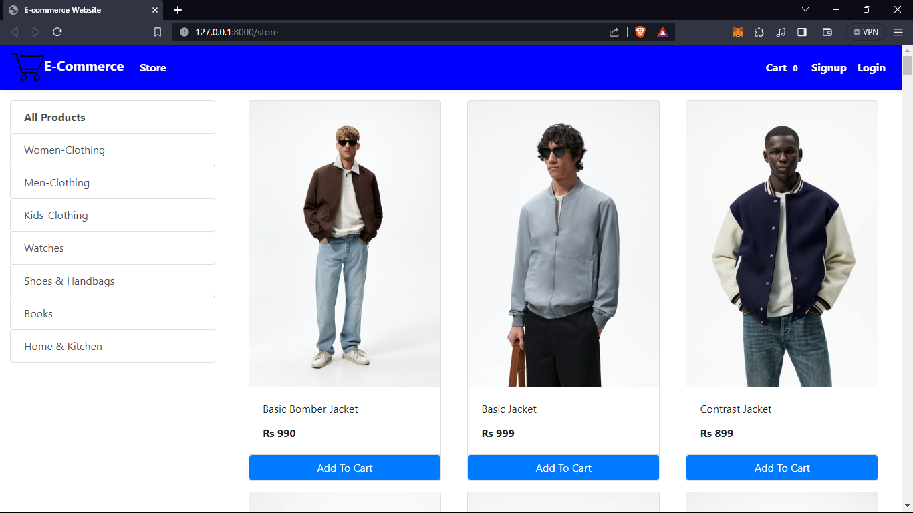
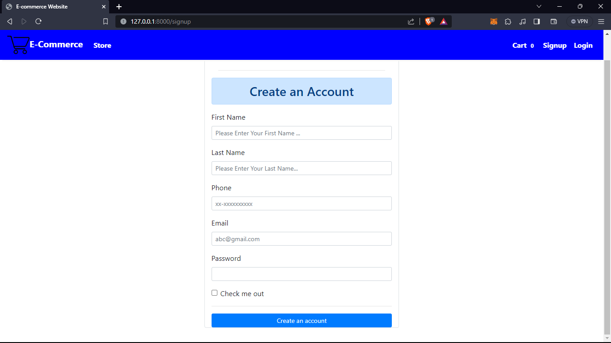
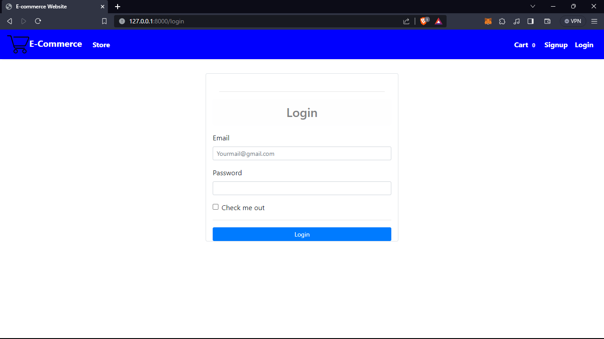
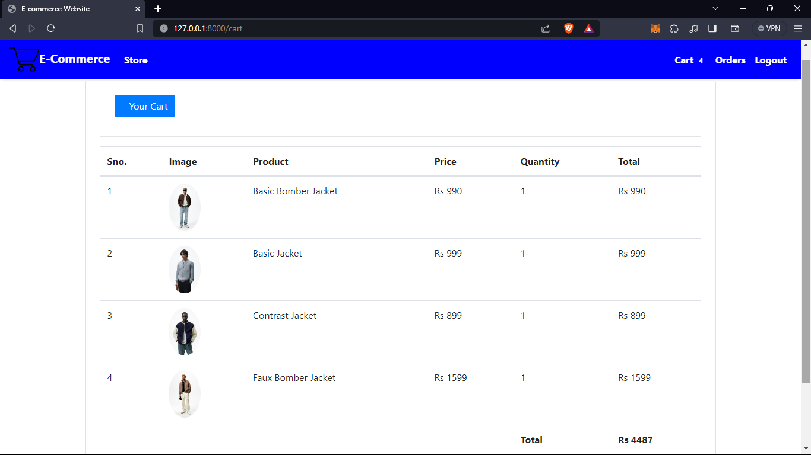
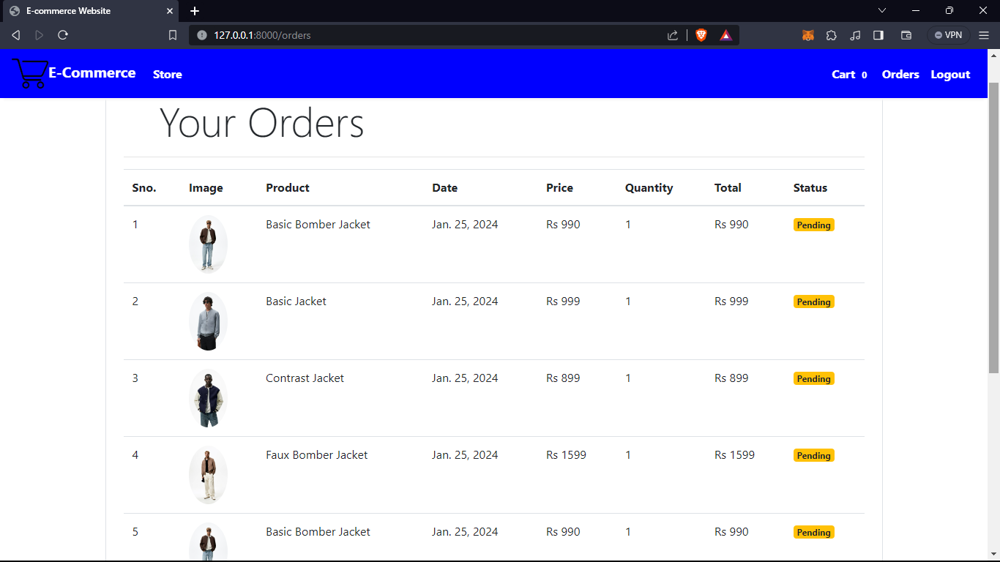

# E-commerce Website

This Project Deals With Developing A Virtual Website ‘E-commerce Website’. 
It Provides The User With A List Of The Various Products Available For Purchase In The Store.
For The Convenience Of Online Shopping,A Shopping Cart Is Provided To The User. After The Selection Of The Goods,It Is Sent For The Order Confirmation Process. 
The System Is Implemented Using Python's Web Framework Django.

My Future Enhancement Would Be  
1.Email Integration  
2.Payment Gateway  

1: clone project. [git clone https://github.com/Rohan03march/Ecommerce ]  
2: cd Ecommerce  
3: pip install requirements.txt  
4: python manage.py makemigrations  
5: python manage.py migrate  
6: python manage.py runserver  

Project Output :   

1. Home Page :  
  

2. SignUp Page:  
  

3. Login Page:  
  

4. Carts Page:  
  

5. Orders Page:  
 

